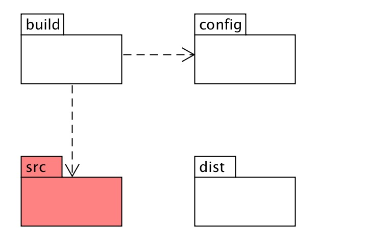
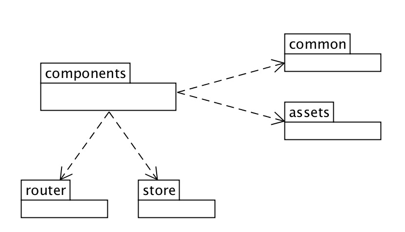
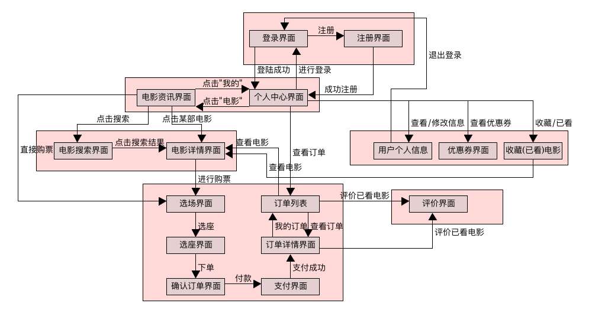
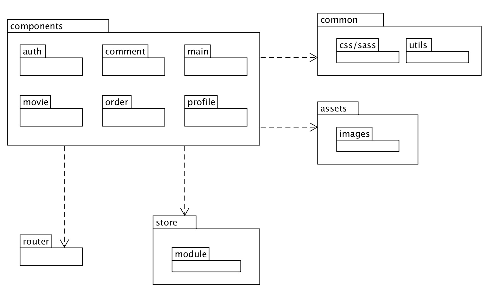

# 软件设计文档
##### 小组成员：黄建武、洪创煌、骆铭涛、陈平永

项目涉及到前端和后端的开发，我们在这里采取了前后端分离的设计思路。整个应用使用了 MySQL 作为数据库存储结构化数据，搭建了 Python flask 服务器，用于提供 RESTful 接口服务。同时，我们还建立了 NodeJS express 服务器作为后端和应用的中间层，通过 HTTP 代理来实现前后端分离。总的架构设计图如下所示，无论是开发还是生产环境的 NodeJS 服务器，都是作为中间层。dev-server 作为开发时服务器，不会涉及资源压缩等内容，纯粹地提供前端资源和接口转发服务，方便进行开发。而prod-server则对前端资源进行了压缩并实现H5缓存等机制，适应生产环境中的性能需求。NodeJS 中间层划分为前端的范畴，分离了前端和后端，使得两边的开发可以同步进行，中间只需要依赖 RESTful 接口进行对接。这种模式可以让后端只专注于接口和数据库的开发而不必关注如何提供前端资源，前端资源的提供以及缓存、压缩等涉及加载速度的内容则全部交由前端工程师控制。


根据以上架构，我们可以把项目划分为两个子项目，FE 和 Server，让前端工程师和后端工程师分别管理自己的项目，进行开发工作。接下来详细介绍前端项目和后端项目的技术选型、架构设计以及模块划分。

## 一、Front-End
#### 1、技术选型以及理由
前端采用的技术栈为webpack+vue全家桶(vue/vue-router/vuex/vue-material)+axios。

* webpack：项目构建打包
* vue：一个类MVVM的渐进式JavaScript框架
* vue-router：单页应用前端路由
* vue-material：UI框架
* vuex：应用数据状态管理
* axios：ajax异步请求工具库

Vue 是当下前端开发中的前沿技术框架，Vue 的核心库只关注视图层，它不仅易于上手，还便于与第三方库或既有项目整合。另一方面，当与单文件组件和 Vue 生态系统支持的库结合使用时，Vue 也完全能够为复杂的单页应用程序提供驱动。Vue 支持组件化开发，其独特的 .vue 文件可以将组件的HTML/CSS/JS代码整合在一个文件中，又不会像 React 那样将所有HTML/JS混写，非常有利于进行代码管理。Vue 也支持响应式、双向数据绑定等 MVVM 特性，能够很好地支持丰富的用户交互体验。vue-router 和 vuex 是官方提供的前端路由和数据状态管理的库，能够完美地结合 Vue 框架，实现前端路由和应用数据状态管理，代码结构清晰，程序复杂度降低。应用数据状态管理也采取了单例模式的思想，优化了应用的内存占用情况，加上轻量的vietual DOM实现，使得它无论从代码结构或者性能上，都能够有很好的表现。由于代码轻量，相对于 angular 等庞大臃肿的框架来说，代码体积更小。我们的项目做的是移动端的web，对网页性能和加载速度都有所要求，Vue 能够很好地满足我们项目的需求。

vue-material 是 Google material design 风格组件在 vue 框架下的实现，是一套优雅的 UI 框架。选用该框架能够贴合设计图，实现更好的移动端用户体验。该框架封装了多种 UI 组件，使用方便，我们项目所需要的组件都可以在这里找到。它还支持按需加载，使我们能够只引用需要的组件，无需引入整个库，减少了前端代码体积。

axios 是一个基于 promise 的工具库，使用这个库可以给服务端发送 ajax 请求。由于这个库基于 promise，使得我们在处理异步请求的时候不需要嵌套回调函数，代码架构上有了极大优化，可维护性更高。另外这个库是纯粹的用于发送 ajax 请求的库，所以代码体积非常小，整合到我们的前端项目中几乎不会影响前端的加载速度。

webpack 是当下前端最流行的构建打包工具，利用 webpack 搭配相应的 loader，我们可以在前端项目中使用 es6 进行开发，效率更高。开发完成后，webpack 还可以帮我们完成构建，将代码编译到 es5 以兼容大部分浏览器。webpack 2优化了构建打包的算法，优化前端的模块加载，使得构建打包后的产品代码体积更小。

#### 2、架构设计
前端项目主要涉及应用界面和业务逻辑开发以及产品构建，同时还要提供配置项用于配置构建打包的目标路径以及代理服务器的地址等信息。根据需要初步确定项目需要有以下4个包。

1. build：运行提供开发环境和构建项目的代码
2. config：项目的webpack打包配置、http代理配置
3. src：项目的源代码，主要都在src里面进行开发
4. dist：项目构建后的产品文件

无论是开发或者构建，都需要依赖到config里面的配置和src里面的源码。本项目使用webpack进行打包，build里面的代码会根据config的配置来调整webpack的打包规则，例如是否开启gzip、构建产品目标路径、HTTP代理规则等。调整好配置之后会将src里面的源码进行打包，如果是构建的话，由于config里面进行了设置，最终的产品文件都会存放到dist里面。



接下来继续设计 src 包的具体结构。我们的应用是一个前端单页应用，所以界面渲染、路由控制等操作都是在前端完成。采取组件化开发的思想，将每个页面抽象为一个组件，当然，界面中也可以包含它的子组件。这样，我们可以通过组件来定位每个界面的代码，方便管理。应用的界面跳转由前端路由 router 进行控制，整个应用的数据都抽象到位于全局位置的 store 进行管理，实现界面(view)和数据(data)的分离。应用的每个界面可能还会使用到公共的资源，例如公共样式、工具函数等等，我们可以将这些公共功能抽离并封装到 common 包中进行使用。assets 则是存放前端的静态资源，例如图标文件、图片等。



#### 3、模块划分
根据设计图和应用的业务逻辑，我们可以得到以下界面关系图。根据每个界面的业务逻辑关联度和操作上的关联度，可以大致将应用的所有界面划分到6个模块中，如下图中红色框所划分的模块。电影资讯界面和个人中心界面是作为应用的主界面上的两个tab，在操作上具有一定的关联性，代码实现上都是实现为tab，有较多相似性，因此划分到同个模块。



按照界面划分好的情况，我们可以将组件包 components 细分为6大模块，将每个界面组件根据上面的划分情况放到相应的模块中进行管理。接着继续细分其他包，common 包可以划分为 css/sass 和 utils，项目中有公共样式和公共工具函数，其他的公共内容几乎没有，因此这里只划分了两个模块（公共组件一般可以直接引用 UI 框架的组件）。router 只提供路由配置和控制功能，不需要再继续划分。store 里面可以分出个 module 包用于存放各个模块的数据（如电影模块、评论模块、订单模块等），每个数据模块都对应一个js文件，因此不需要在 module 里面继续划分目录。



最后，综合考虑使用的技术框架，并根据应用需要的页面组件，我们可以完善得到详细的项目结构如下所示。后续的开发可以明确地进行分工，每个人负责不同的模块，然后进入到相应的包里面进行开发即可。顶层的模块如果需要修改配置或者更新内容，由项目负责人与成员商定后进行修改即可，做好顶层配置后，可以很好地解耦各模块，使得项目能够顺利、快速地完成开发。如果过需要新增界面、功能，引入新组件，也可以很方便地将新内容添加到项目中去。

```txt
├─build：存放构建用到的相关文件
├─config：存放配置文件
├─data：存放伪数据以及数据生成器供前端开发使用；也可以存放图片等静态资源
├─src：前端开发的源码
│   ├─assets：图片等静态资源
│   ├─common：公共样式或js文件
│   │    ├─css：字体和图标文件
│   │    │  ├─font.css：字体文件
│   │    │  └─icon.css：图标文件
│   │    ├─sass：公共样式文件
│   │    └─utils：公共工具函数库
│   │       ├─DateUtils.js：处理时间日期的工具函数
│   │       ├─Form.js：表单工具函数
│   │       └─LazyLoad.js：实现图片懒加载
│   ├─components：前端组件
│   │    ├─auth：登录注册相关界面
│   │    │   ├─Load.vue：加载控件
│   │    │   ├─Signin.vue：登录界面
│   │    │   └─Signup.vue：注册界面
│   │    ├─comment：电影评论评分相关界面
│   │    │   └─MovieComment.vue：对电影进行评论评分界面
│   │    ├─main：应用的主体界面
│   │    │   ├─Main.vue：主体界面外层容器
│   │    │   ├─Me.vue：个人中心界面
│   │    │   └─Movies.vue：电影资讯界面
│   │    ├─movie：电影相关界面
│   │    │   ├─MovieDetail.vue：电影详情界面
│   │    │   └─MovieSearch.vue：电影搜索界面
│   │    ├─order：订单相关界面与组件
│   │    │   ├─MyOrders.vue：全部/待付款/待放映/已放映订单列表界面
│   │    │   ├─OrderDetail.vue：订单详情界面
│   │    │   ├─OrderPay.vue：付款界面
│   │    │   ├─PasswordInput.vue：支付密码输入控件
│   │    │   ├─Reservation.vue：确认下单界面
│   │    │   ├─SelectCoupon.vue：选优惠券界面
│   │    │   ├─SelectScreen.vue：选场次界面
│   │    │   └─SelectSeat.vue：选座位界面
│   │    └─profile：用户中心相关界面
│   │        ├─ChangeInfo.vue：修改个人信息界面
│   │        ├─Coupon.vue：优惠券组件
│   │        ├─Coupons.vue：优惠券列表界面
│   │        ├─MovieCollection.vue：收藏/想看/已看电影列表界面
│   │        └─UserInfo.vue：用户个人信息界面
│   ├─router：前端路由
│   │    └─index.js：前端路由信息配置文件
│   ├─store：应用的全局数据状态管理
│   │    ├─modules：数据状态模块
│   │    │   ├─auth.js：登录注册相关接口与数据状态
│   │    │   ├─comment.js：电影评价相关接口与数据状态
│   │    │   ├─coupon.js：优惠券相关接口与数据状态
│   │    │   ├─favorite.js：电影收藏相关接口与数据状态
│   │    │   ├─movies.js：电影相关接口与数据状态
│   │    │   ├─order.js：订单相关接口与数据状态
│   │    │   └─screen.js：场次相关接口与数据状态
│   │    └─index.js：数据状态模块配置文件
│   ├─App.vue：应用的最外层结构
│   └─entry.js：应用的入口文件；第三方组件和公共文件在此引入
└─app-server.js：应用服务器，提供构建后的前端静态资源，并进行接口代理
```

## 二、Server